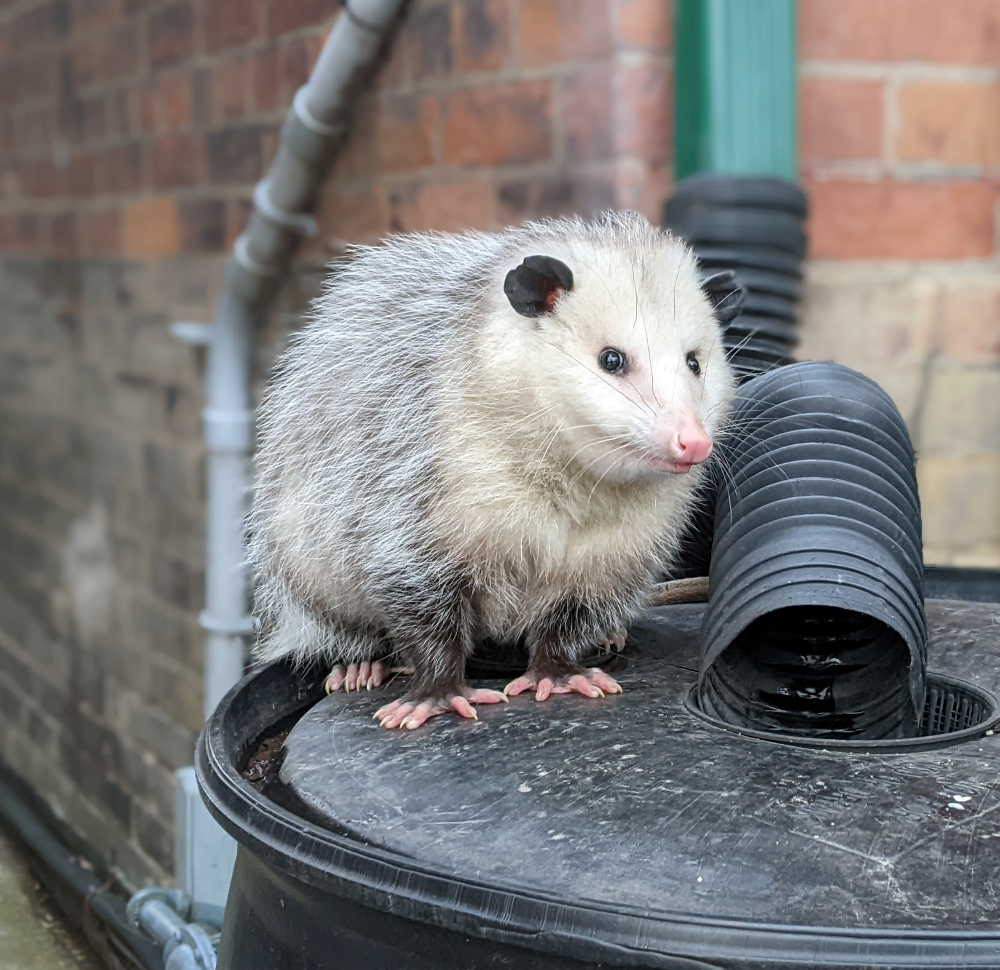

<section class="introduction">

Hi there!! My name is Beauregard, but my friends call me Bo. I'm a mother opossum living in Toronto, and I love exploring the city with my family. Opossums may be rare in Toronto, but we're a hardy bunch!

</section>

<section class="hobbies">
<h2>My Hobbies</h2>

- Foraging for food in the city
- Snuggling with my babies
- Playing dead to avoid predators (just kidding!)
</section>

<section class="blog-intro">
<h2>Blog</h2>

Welcome, fellow food adventurers, to my little corner of the world where I, Bo the opossum, share my passion for dumpster dining! As a proud, resourceful opossum living in the bustling city of Toronto, I've discovered that discarded food can be an eco-friendly, delightful, and diverse source of nourishment. Join me on my urban foraging adventures as I explore the hidden gems in trash bins, uncovering an endless buffet of flavors and textures. Here, I'll be sharing my culinary discoveries and tips on how to thrive in this human world. So, get ready for a wild ride through the world of refined scavenging and prepare to view trash in a whole new light!

### Latest Posts

  
    - [{{ post.data.title }}]({{ post.url | url}}) 
  

</section>

<section class="kids-intro">
<h2>Meet the Kids</h2>
I love my little ones to bits, even when they keep me up all night with their antics. We like to spend our time exploring the city and trying out new foods. I'm so proud of each and every one of them!



<h3 class="kid-name">{{ kid.name }}</h3>
<!-- <ul>

<li>Birth order: {{ kid["birth order"] }}</li>
<li>Personality: {{ kid.personality }}</li>
<li>Favourite food: {{ kid["favourite food"] }}</li>
<li>Hobby: {{ kid.hobby }}</li>
<li>Dream: {{ kid.aspiration }}</li>

</ul> -->

{{ kid.description }}



I'm so proud of my little ones and can't wait to see what they accomplish in life.
</section>

<section class="thanks">
Thanks for stopping by! Hope to see you around the city soon.
</section>
